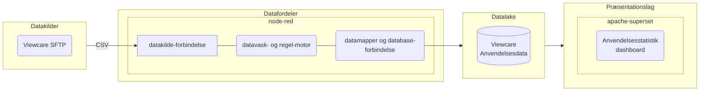

# 📊 Visning statistik på anvendelsen af virtuel hjemmesygepleje

### Beskrivelse

Anvendelses statistikken er opbygget af en række løskoblede åbne komponenter

Datafordeleren sørger for at forbinde til datakildernes snitflader og foretager automatiske filtrer og konverteringerpå data der hentes fra snitfladerne inden de skrives i Datalake

### Afhængigheder
Løsningen er afhængig af en række software komponenter og en række netværksadgange til eksterne ressourcer for at fungere.

Krav til installerede software pakker 

:gear: | [Apache SuperSet 2.0]()  |  [Node-RED 3.0.2](https://nodered.org/docs/getting-started/windows)  | 

Krav til netværksadgange til datakilder

:cloud: | sftp viewcare

Krav til anvendelse af miljøvariable:

:heavy_dollar_sign: | DB_USER | DB_PASS | DB_HOST | DB_DATABASE | VIEWCARE_SFTP_USER | VIEWCARE_SFTP_PASS |

### Ressourcer

:books: [Dokumentation og projektbeskrivelse](https)

:spiral_calendar: [Projektoverblik og opgavestyring](https://github.com/orgs/Randers-Kommune-Digitalisering/)
